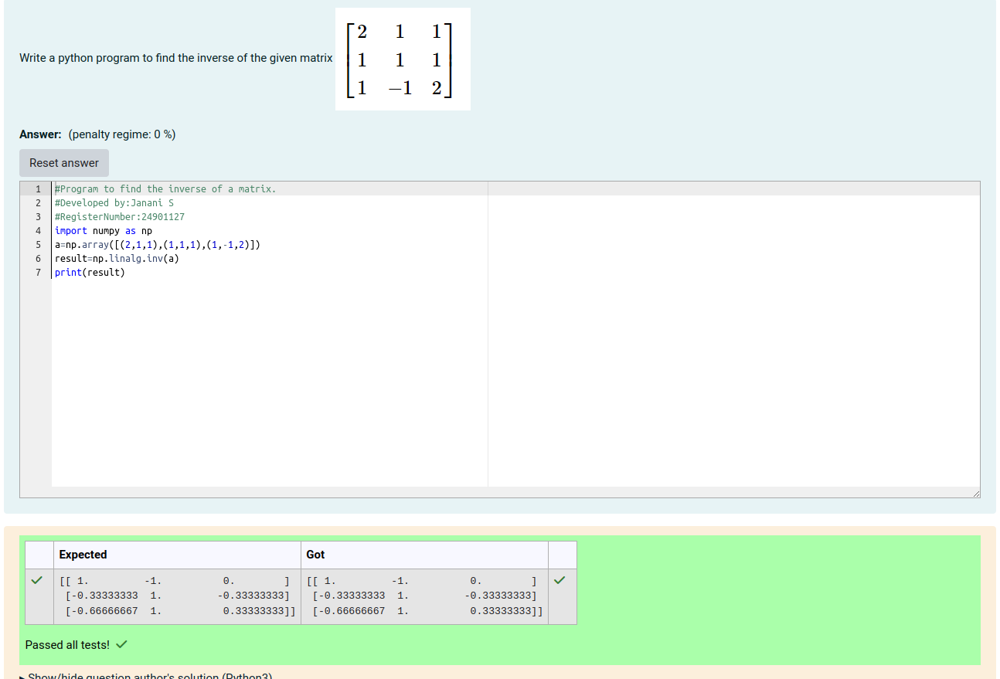

# INVERSE-OF-A-MATRIX
## Aim:
To write a python program to find the inverse of a matrix
## Equipment’s required:
1. 	Hardware – PCs
2. 	Anaconda – Python 3.7 Installation / Moodle-Code Runner
## Algorithm:
### Step1 : import the numpy module to use the build-in functions for calculation
### Step 2: prepare the lists from each linear equations and assign in np.array()
### Step 3: using the np.linalg.inv(),we can find the inverse of the given matrix
### Step 4: end the program

## Program:
```
#Program to find the inverse of a matrix.
#Developed by:Janani S
#RegisterNumber:24901127
import numpy as np
a=np.array([(2,1,1),(1,1,1),(1,-1,2)])
result=np.linalg.inv(a)
print(result)
```
## Output:

## Result:
Thus the inverse of given matrix is successfully solved using python program

